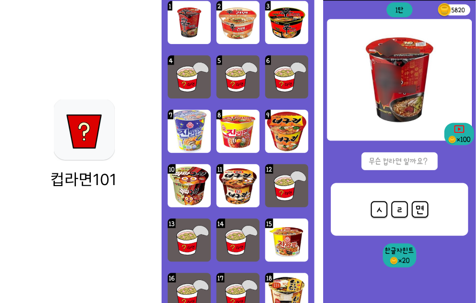

# 컵라면 초성 퀴즈 앱

React Native와 Expo를 사용하여 개발한 컵라면 초성 퀴즈 애플리케이션입니다.

## 개발 동기 및 과정

처음에는 게임을 만들고 싶었지만, 유니티와 같은 게임 엔진을 다뤄본 경험이 없어 비교적 접근하기 쉬운 퀴즈 애플리케이션을 만들기로 결정했습니다.

컵라면, 아이스크림, 영화 제목을 맞추는 간단한 퀴즈 앱들이 스토어에서 높은 다운로드 수를 기록하는 것을 보고, '내가 더 재미있게 만들어보자!'는 생각으로 프로젝트를 시작하게 되었습니다.

100개가 넘는 퀴즈 데이터를 직접 만들고, 이미지 최적화와 같은 데이터 가공 과정을 통해 앱의 용량을 줄이는 경험을 할 수 있었습니다.

군 전역 후 처음으로 만드는 애플리케이션이라, 익숙한 브라우저 환경이 아닌 PC 환경에서 개발 환경을 설정하는 데 많은 어려움을 겪었습니다.

개발 과정에서 효과음과 배경음악을 적용해보았고, 리워드 광고를 처음으로 구현해보는 등 다양한 시도를 했습니다.

## 앱 스크린샷



## 주요 기능

- **컵라면 퀴즈:** 흐릿하게 처리된 컵라면 이미지를 보고 초성 힌트를 참고하여 정답을 맞힙니다.
- **스테이지:** 다양한 컵라면 퀴즈가 여러 스테이지에 걸쳐 제공됩니다.
- **코인 시스템:**
    - 퀴즈 정답을 맞히거나 광고 시청을 통해 코인을 획득할 수 있습니다.
    - 획득한 코인으로 퀴즈에 대한 힌트를 얻을 수 있습니다.
- **인앱 결제 (In-App Purchase):**
    - 필요에 따라 코인을 직접 구매할 수 있습니다.
    - 인앱 결제를 통해 배너 광고를 제거하는 기능을 제공합니다.
- **광고:**
    - Google AdMob을 연동하여 배너 광고와 보상형 광고를 앱 내에 포함시켰습니다.
- **공유 기능:**
    - 친구에게 현재 풀고 있는 퀴즈를 공유하여 도움을 요청할 수 있습니다.

## 기술 스택

- **프레임워크:** React Native, Expo
- **상태 관리 및 내비게이션:**
    - `React Navigation`을 사용하여 화면 간의 이동을 관리합니다.
    - `AsyncStorage`를 활용하여 사용자의 퀴즈 진행 상황, 코인 수량 등의 데이터를 로컬에 저장합니다.
- **UI/UX:**
    - `styled-components`를 사용하여 컴포넌트 기반의 스타일링을 적용했습니다.
    - `react-native-shadow-2`, `react-native-modal` 등의 라이브러리를 활용하여 사용자 인터페이스를 개선했습니다.
- **광고 및 인앱 결제:**
    - `react-native-google-mobile-ads`를 통해 Google AdMob 광고를 연동했습니다.
    - `react-native-iap`를 사용하여 인앱 결제 기능을 구현했습니다.
- **기타:**
    - `expo-av`로 효과음을 재생합니다.
    - `react-native-share`와 `react-native-view-shot`을 사용하여 화면 공유 기능을 구현했습니다.

## 화면 구성

- **Home:** 앱의 시작 화면으로, 게임 시작 버튼과 사운드 설정 기능이 있습니다.
- **StageSelect:** 전체 퀴즈 스테이지를 보여주며, 사용자가 원하는 스테이지를 선택하여 게임을 시작할 수 있습니다.
- **Quiz:**
    - 컵라면 이미지와 초성 힌트가 주어집니다.
    - 정답을 입력하고 확인할 수 있습니다.
    - 코인을 사용하여 힌트를 얻거나, 광고를 시청하여 코인을 충전할 수 있습니다.
    - 친구에게 문제를 공유하는 기능이 있습니다.

## 실행 방법

```bash
# 의존성 설치
npm install

# Expo 서버 실행
npm start
```

⚠️ 참고: 본 앱은 Android 전용으로 개발되었으며, Google Play Store에 등록되었으나
3년간 업데이트가 없어 스토어에서 삭제되었습니다. 현재는 설치 링크가 없습니다.
